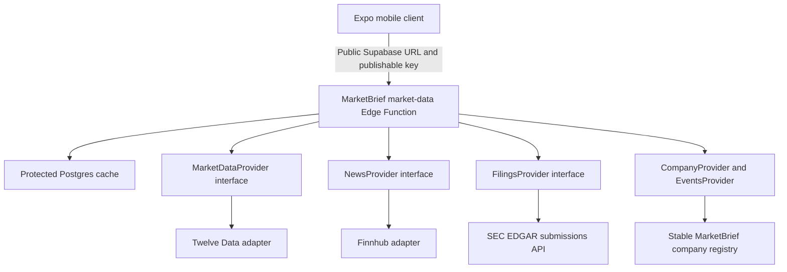

# Milestone 6 — Real Data Foundation

## Outcome

Milestone 6 converts MarketBrief from a mock-only shell into a mobile client with a secure, vendor-neutral real-data path. The schema and `market-data` Edge Function are deployed to the connected Supabase development project. Demo fixtures remain available only through explicit `DEMO` mode; `REAL` mode never silently substitutes them.

## Architecture

The Expo client contains no Twelve Data, Finnhub, SEC contact, service-role, or database secret. It posts `{ resource, symbol, range? }` to the Edge Function and receives only normalized MarketBrief envelopes containing `data` plus `source`, `provider`, `fetchedAt`, `asOf`, `isStale`, and optional `errorCode`.

## Supabase foundation

The versioned migration creates:

- `company_registry`: stable UUID identity, symbol lookup, exchange, currency, CIK, sector/industry, and nullable licensed-logo provenance;
- `market_data_cache`: normalized JSON payload, provider/source, fetched/as-of/expiry timestamps, and error metadata;
- `provider_request_windows`: storage for provider throttling windows and blocked-until metadata; and
- the `marketbrief_resource_type` enum.

All three tables have Row Level Security enabled. `anon` and `authenticated` privileges are revoked; only the Edge Function’s server role receives data access. The client never queries these tables directly. `supabase/database.types.ts` records the typed schema.

## Providers and normalization

### Twelve Data

`TwelveDataProvider` normalizes US-equity quotes and time series. Quote fields include price, change, percentage change, previous close, open/high/low, volume, exchange, currency, market status, and provider timestamp. Missing optional values remain `null`. Chart ranges map to provider-supported intervals for `1D`, `1W`, `1M`, `3M`, and `1Y`; bars normalize to timestamped OHLCV.

This adapter is development/internal-prototype configuration only. Twelve Data plan terms, attribution, delay, exchange entitlements, and commercial external-display/redistribution rights must be verified in writing before launch.

### Finnhub

`FinnhubProvider` normalizes company-news metadata and earnings-calendar events. MarketBrief stores only the headline, provider-supplied summary when present, publisher, publication timestamp, source URL, related symbols, and provider ID. It does not copy article bodies or summarize content that was not retrieved.

This adapter is development/personal prototype configuration only. Finnhub plan terms and commercial external-display/redistribution rights must be verified before launch.

### SEC EDGAR

`SecEdgarProvider` uses `https://data.sec.gov/submissions/CIK##########.json`, filters to `10-K`, `10-Q`, and `8-K`, and builds canonical SEC archive URLs without scraping filing HTML. `SEC_USER_AGENT` is required and must identify MarketBrief plus a monitored contact address. Requests are spaced by at least 150 ms (about 6.7 requests/second maximum within one function instance), below the SEC fair-access ceiling. Server caching reduces repeated calls further.

## Company identity

Ten currently supported US companies have stable UUIDs and verified-format ten-digit CIK attributes. Symbols are not primary keys and can change independently. Logo fields remain null because Milestone 6 does not introduce a newly licensed logo source.

## Cache strategy

Central TTLs live in one server module:

| Resource | TTL |
| --- | --- |
| Quote | 60 seconds |
| Bars | 5 minutes |
| News | 15 minutes |
| Events | 1 hour |
| Filings | 6 hours |
| Company identity | 7 days |

Fresh cache entries avoid third-party requests. When an expired real entry cannot refresh, MarketBrief may return that same real entry with `isStale: true` and the actual provider error code. It never replaces it with demo content. With no cache, structured errors remain visible: missing secret/configuration, rate limit, network failure, malformed response, unsupported symbol, upstream unavailable, and no result.

### Shared provider quota protection

`provider_request_windows` now backs an atomic `consume_provider_request_budget` Postgres function. Each call holds a short transaction-scoped advisory lock keyed by provider, so Twelve Data, Finnhub, and SEC EDGAR usage is coordinated across Edge Function instances rather than only inside one JavaScript isolate. The function records counts and cooldowns and returns an allow/deny decision without holding a database lock during the external provider request.

Central conservative development limits are:

| Provider | Shared budget | Cooldown |
| --- | --- | --- |
| Twelve Data | 8 requests / 60 seconds | 60 seconds |
| Finnhub | 20 requests / 60 seconds | 60 seconds |
| SEC EDGAR | 6 requests / second | 1 second |

The limiter executes only inside the cache loader. Fresh cache hits do not consume provider budget. If an expired real cache entry exists and the budget is exhausted, stale recovery returns that real entry with `isStale: true` and `RATE_LIMITED`. These application limits cap usage but do not guarantee compliance with every future production provider contract.

## Real and demo behavior

- `EXPO_PUBLIC_MARKETBRIEF_DATA_MODE=REAL` selects the Edge Function path.
- `DEMO` selects explicit local fixtures for tests and design evidence.
- Missing public Supabase configuration in `REAL` mode becomes `MISSING_CONFIGURATION`.
- Provider failures become honest unavailable/rate-limited/error states.
- Demo fixtures are never consulted after a real request fails.

The mode banner remains visible on Today, Markets, Watchlist, Search, and Stock Detail. Real surfaces show normalized freshness/source metadata. No fake `LIVE` badge is used. Index, sector, mood, calendar, editorial story, brief, and Why It Moved areas still backed by fixtures are labeled illustrative rather than presented as provider data.

## Screen wiring

- **Today:** ordered watchlist company quotes and working refresh through `MarketDataProvider`; index/editorial context remains illustrative.
- **Markets:** supported equity mover quotes use the backend; indices, sectors, mood, and calendars remain explicitly illustrative until licensed providers are chosen.
- **Watchlist:** membership/order stay in AsyncStorage; quote values load through the shared provider and errors never display old mock prices.
- **Search:** stable local company registry powers discovery; quote cells use shared provider state.
- **Stock Detail:** quote, five chart ranges, session fields, filings, company-news metadata, events, source, and freshness state use normalized resources.
- **External sources:** provider news displays its actual publisher and publication timestamp, clearly marks external treatment, and opens the original source URL when present. SEC filing rows identify SEC and open the preserved canonical filing URL. Demo records retain explicit demo attribution.
- **Briefs / Why It Moved:** deterministic local, non-AI content remains unchanged in substance and explicitly separate from provider-backed values until Milestone 7.

## Secrets and setup

`.env.example` contains names only:

- client-safe: `EXPO_PUBLIC_MARKETBRIEF_DATA_MODE`, `EXPO_PUBLIC_SUPABASE_URL`, `EXPO_PUBLIC_SUPABASE_PUBLISHABLE_KEY`;
- server-only: `TWELVE_DATA_API_KEY`, `FINNHUB_API_KEY`, `SEC_USER_AGENT`.

All `.env*` files except `.env.example` remain ignored. Provider secrets must be configured through Supabase function secrets and never logged, embedded in screenshots, errors, source maps, or Expo configuration.

## Verification status

Verified locally:

- provider normalization with deterministic response fixtures;
- malformed-response, transport-failure, missing-secret, provider rate-limit, SEC request-gate, stale-cache, and no-fallback behavior;
- `npm install`: completed; dependency tree was already current (860 packages audited) and npm reported 22 advisories (8 moderate, 14 high);
- `npm run typecheck`: passed with no TypeScript errors;
- `npm run lint`: passed with no ESLint errors;
- `npm test`: 71 tests passed, with 0 failures and 0 skipped;
- `npm run doctor`: 20/20 Expo checks passed;
- `npm run functions:check`: Deno type/syntax check passed for the Edge Function;
- `npx expo export --platform web`: passed and exported 39 static routes to ignored `dist/`; and
- Expo development startup: Metro started successfully in `REAL` mode with the connected project configuration supplied only in process memory, and the local web endpoint returned HTTP 200.

Remotely verified on the connected development project:

- the `real_data_foundation` and `provider_request_budgeting` migrations applied successfully;
- `company_registry`, `market_data_cache`, and `provider_request_windows` exist with RLS enabled;
- protected table access and the quota RPC remain unavailable to mobile roles, while `service_role` can execute the quota RPC;
- `market-data` Edge Function version 2 is active;
- two consecutive `company:AAPL` requests returned HTTP 200 from `marketbrief-registry` with the same `fetchedAt`, proving a fresh cache hit; and
- missing Twelve Data, Finnhub, and SEC configuration returned explicit HTTP 503 `MISSING_SECRET` responses, consumed no provider budget, and did not substitute demo data.

Not verified or claimed:

- local migration application/database lint, because Docker was not running on this machine;
- successful live Twelve Data or Finnhub provider retrieval because their server secrets are not configured;
- successful live SEC retrieval because a monitored `SEC_USER_AGENT` value is not configured;
- production licensing or market-data redistribution rights;
- native Android/iPhone UI behavior for Milestone 6.

## Public endpoint abuse boundary

The mobile publishable key is not a secret and is insufficient protection by itself. Before real authentication, the Edge Function accepts only authenticated Supabase publishable/secret-key calls, POST JSON bodies no larger than 4 KiB, six known resource names, five known chart ranges, and ten allowlisted symbols. Central cache and shared provider budgets prevent possession of the publishable key from producing unbounded paid-provider traffic. This is a global protective ceiling, not per-user authorization; stronger identity-based abuse controls are deferred until real authentication is approved.

## Activation status

Codex MCP is configured and OAuth-authenticated for project ref `jkatugzutluclvnhqhle`. The `real_data_foundation` and `provider_request_budgeting` migrations are applied, and `market-data` Edge Function version 2 is active. The company-registry path is operational and cached. Quote/chart, news/events, and filing retrieval remain honestly unavailable until `TWELVE_DATA_API_KEY`, `FINNHUB_API_KEY`, and a monitored `SEC_USER_AGENT` are configured as server-side function secrets. The client publishable key was used only transiently for verification and was neither printed nor written to the repository.

## Deferred scope

The standalone local Milestone 5 Alerts/Preferences plan is cancelled. Milestone 7 AI/chat/grounded briefs and Milestone 8 alerts/preferences/push are not included. No authentication backend, AI model call, chatbot, alert, push notification, payment, paywall, subscription, brokerage, trading, holding, or advanced expansion feature was added.
